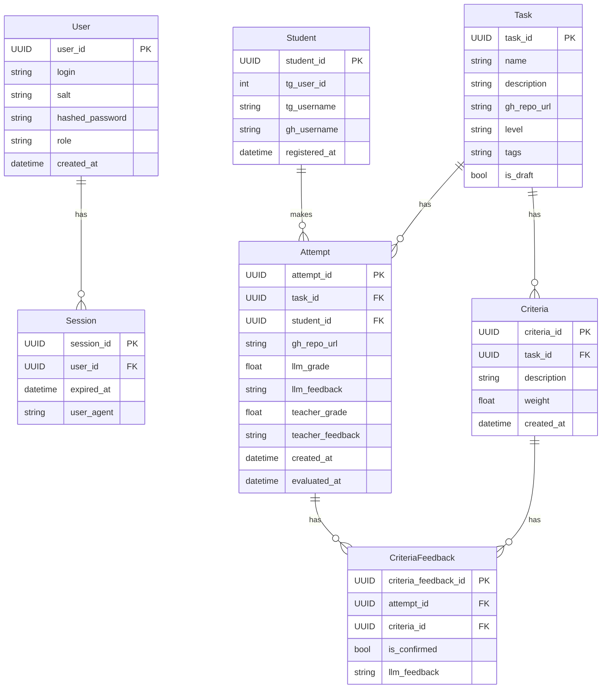

## Документация

### Модель данных


## Разработка

### Установка библиотек с uv
```bash
uv sync
```

### Запуск контейнеров для разработки
```bash
docker compose -f dev.docker-compose.yaml up -d
```

### Запуск в dev-режиме
```bash
uv run fastapi dev src/app.py
```

### Запуск форматтера и линтера с автофиксами
```bash
uv run ruff format ./src
uv run ruff check --fix src
```

### Запуск в production-режиме
```bash
uv run granian --interface asgi src.app:app
```