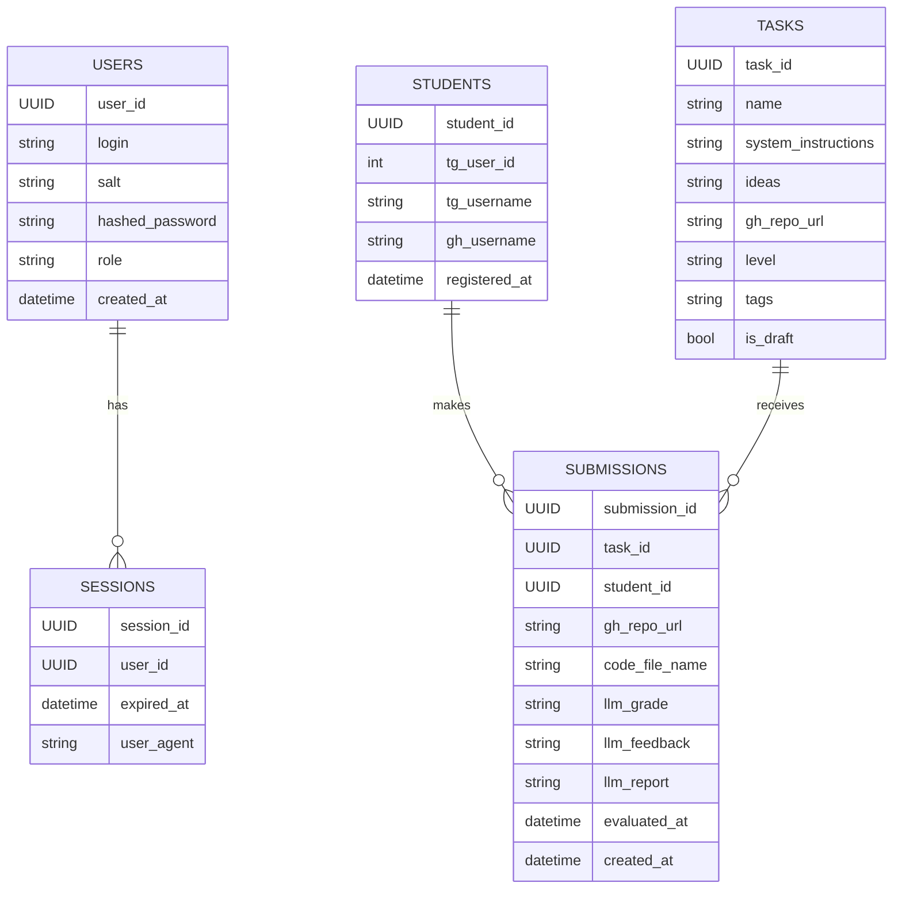

## Документация

### Модель данных


## Разработка

### Переменные окружения
```bash
MODE=dev
# Postgres Envs
POSTGRES_DB=grading
POSTGRES_USER=postgres
POSTGRES_PASSWORD=password
POSTGRES_PORT=5432
POSTGRES_HOST=localhost
# Minio Envs
MINIO_PORT=9000
MINIO_HOST=localhost
MINIO_ROOT_USER=minio
MINIO_ROOT_PASSWORD=password
MINIO_ACCESS_KEY=access-key
MINIO_SECRET_KEY=secret-key
MINIO_BUCKET=submissions
# Kafka
KAFKA_BOOTSTRAP_SERVERS=localhost:29092
KAFKA_UI_ADMIN_LOGIN=admin
KAFKA_UI_ADMIN_PASSWORD=password
```

### Установка библиотек с uv
```bash
uv sync
```

### Запуск контейнеров для разработки
Контейнер приложения запускается в reload-режиме для разработки
```bash
docker compose -f dev.docker-compose.yaml build
docker compose -f dev.docker-compose.yaml up -d
```

### Запуск в dev-режиме
```bash
uv run fastapi dev src/app.py --port 8000
```

### Запуск форматтера и линтера с автофиксами
```bash
uv run ruff format ./src
uv run ruff check --fix src
```
